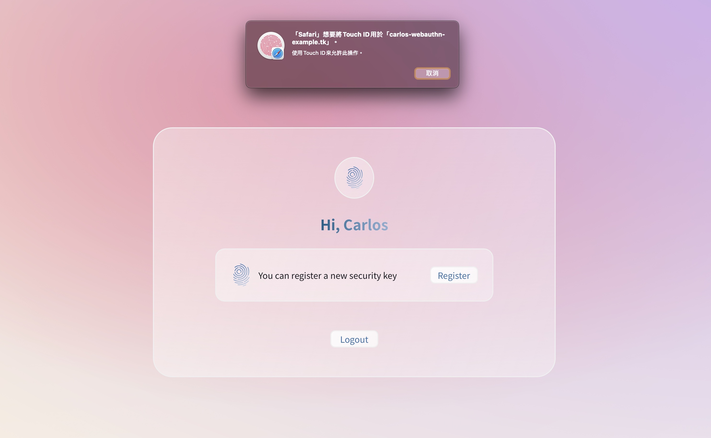

<!-- Title & Logo -->
<h1 align="center">Webauthn API</h1>

<!-- tag & links (Version\Lang\Package) -->
<p align="center">
    <!-- laradock lastest -->
    
    <!-- laravel 8.0 -->
    
    <!-- asbiin/laravel-webauthn 0.9.0 -->
    
    <!-- tymon/jwt-auth 1.0 -->
    
</p>
<p align="center">
    Source：<a href="https://github.com/evilz0212/ex-fe-webauthn">Github [F-E]</a>、<a href="https://github.com/evilz0212/ex-be-webauthn">Github [B-E]</a> ｜ 
	Demo：<a href="https://carlos-webauthn-example.tk/">GCP server</a> ｜ 
	Design：<a href="https://www.figma.com/file/VT83sXiCd5nfAFzSC13T28/ex-be-webauthn?node-id=1%3A3">Figma</a>
<p>

<!-- Overview (Preview\Purpose\Description) -->


## Overview
> 使用雙重因素登入（密碼+生物辨識）
#### Target
1. Docker 快速部署前後端專案
   - Laradock 環境建置
   - nginx-proxy 反向代理後端 api
2. GCP 架設雲端主機
   - SSH 金鑰連線
   - Domain 自訂網域申請
   - SSL 憑證申請
   - clamav 定期防毒掃描
   - 資安設定（防火牆設定、TLS 版本、限制同源iFrame）
3. Laravel 後端專案建構
   - Laravel 8 新版本調適
   - Jwt-auth token 驗證機制
   - Laravel-webauthn 生物辨識套件(2FA)

#### Detail
-  雲端主機：
   -  Server：GCP, Cloud DNS, VM(ubuntu 18.04)
   -  Domain：freenom
   -  SSL：sslforfree
   -  App：docker, docker-compose, nginx, clamav
-  後端框架：Laravel(8.0)
-  應用套件：tymon/jwt-auth、asbiin/laravel-webauthn

<!-- Get started (Install\Step) -->
## Get started
#### Step.1 主機環境設定

1. Install docker & docker-compose
2. git clone

#### Step.2 專案設定

1. Copy .env file
```
cp .env.example .env
cp .Laradock/env-example .Laradock/.env
```
2. Copy .crt & .key to .Laradock/nginx/ssl/
3. Create Images
```
cd .Laradock && docker-compose up -d nginx mysql
```
#### Step.3 專案設定(進入 docker bash)

1. Create mysql database
```
docker-compose exec mysql bash
mysql -u root -p
create database laravel
```
2. Laravel command
```
docker-compose exec workspace bash
composer install
php artisan key:generate
php artisan jwt:secret
php artisan migrate
```

#### Step.4 開啟測試頁

1. 修改本機 host ```127.0.0.1 carlos-webauthn-example.tk```
2. 後端首頁：https://carlos-webauthn-example.tk:8899/

## APIs
#### JWT Login
POST ```/api/auth/register```：Register a new member

POST ```/api/auth/login```：Member login

GET ```/api/auth/getUser```：Update member information

#### Webauthn
GET ```/api/webauthn/register```：Get datas to register a new key

POST ```/api/webauthn/register```：Post datas after a WebAuthn register check

GET ```/api/webauthn/auth```：Get datas to login

POST ```/api/webauthn/auth```：Post datas after a WebAuthn login validate

DELETE ```/api/webauthn/${key}```：Delete registered key

<!-- Partner -->

<!-- License -->
